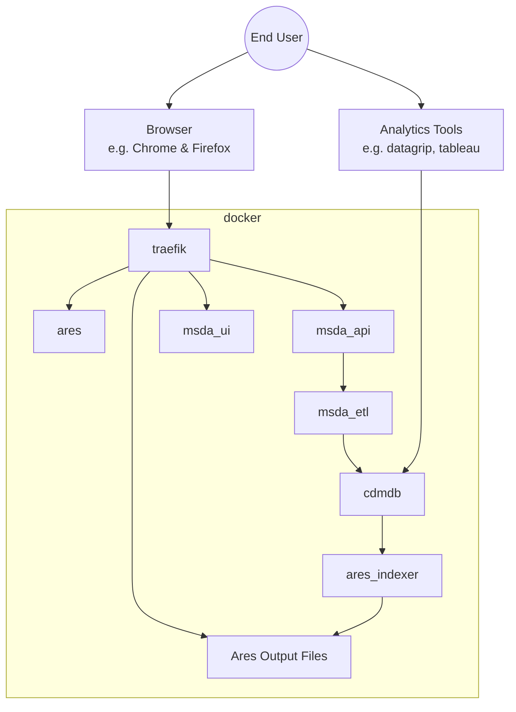

# msda_switchbox

A project of the [MS Data Alliance](https://www.msdataalliance.org/) and [edenceHealth](https://edence.health/)

## Connectivity Overview

## Notes

- Released under an open source license [LICENSE.txt](LICENSE.txt)
